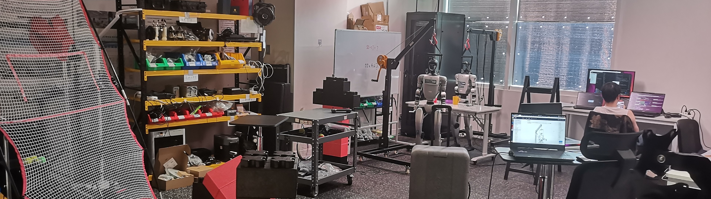

<h1 align="center">
  <strong>🌱 Grow upward by rooting downward 🚀</strong>
</h1>

## Hi there 👋

- 🔭 I am currently working as a research assistant in [Liang Junwei's laboratory(Precognition Lab)](https://junweiliang.me/) at HKUST(GuangZhou).
- 🌱 I am currently learning reinforcement learning, imitation learning, and teleoperation for whole-body control of humanoid robots.
- 💬 Ask me about humanoid control, teleoperation, and embodied intelligence.
- 📫 You can reach me at: kelun0603@gmail.com or kelun0603@163.com
 

  

